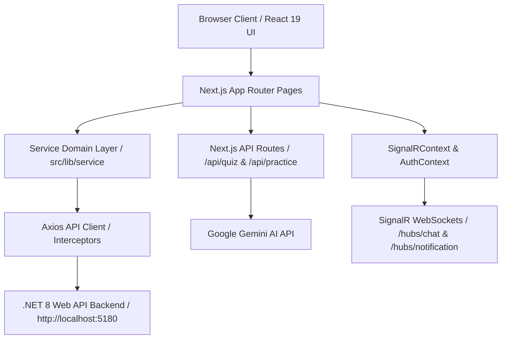

<div align="center">

# ⚛️ Online Learning Platform — Frontend (`prn232-fe`)

[](https://nextjs.org/)
[](https://react.dev/)
[](https://www.typescriptlang.org/)
[](https://tailwindcss.com/)
[](https://ai.google.dev/)
[](https://dotnet.microsoft.com/apps/aspnet/signalr)
[](LICENSE)

A state-of-the-art, high-performance web frontend application for an Online E-Learning Platform. Built with **Next.js 16 (App Router)**, **React 19**, **TypeScript**, and **Tailwind CSS v4**, this application offers a premium Glassmorphism UI, real-time WebSockets communication, and generative AI automated quiz & grading engines.

[Features](#-key-features) • [Architecture](#-architecture--data-flow) • [AI Integration](#-ai-engine--gemini-integration) • [Environment Setup](#-environment-configuration) • [Quickstart](#-getting-started)

</div>

---

## 📋 Table of Contents

- [Overview](#overview)
- [Key Features](#-key-features)
- [Architecture & Data Flow](#-architecture--data-flow)
- [AI Engine & Gemini Integration](#-ai-engine--gemini-integration)
- [Real-Time SignalR WebSockets](#-real-time-signalr-websockets)
- [Glassmorphism Design System](#-glassmorphism-design-system)
- [Environment Configuration](#-environment-configuration)
- [Mock vs Real API Modes](#-mock-vs-real-api-modes)
- [Project Directory Structure](#-project-directory-structure)
- [Getting Started](#-getting-started)
- [Scripts & Deployment](#-scripts--deployment)

---

## Overview

The `prn232-fe` application provides a seamless, fast, and accessible user experience across all devices. Designed with responsive layouts and modern UI aesthetics, it serves three distinct user roles (**Students**, **Instructors**, and **Administrators**) while interfacing seamlessly with the **.NET 8 Web API** backend and **Google Gemini AI**.

---

## ✨ Key Features

### 🎓 1. Student Learning Experience
- **Course Discovery**: Multi-faceted search and filtering by category, level, price, and keywords.
- **Seamless Enrollment & Checkout**: Integrated PayOS gateway payment flow with automatic sandbox mock fallback.
- **Interactive Player**: Multi-modal learning (HD Video playback, rich article reading, interactive quizzes).
- **AI Practice & Essay Grader**: Real-time feedback and scoring on practice exercises using Google Gemini AI.
- **Certificate Issuance**: Automatic PDF/Digital Certificate rendering upon 100% course completion.
- **Live Instructor Chat**: 1-on-1 instant messaging powered by SignalR WebSockets.

### 👨‍🏫 2. Instructor Workspace
- **Visual Curriculum Editor**: Build structured courses (Modules ➔ Lessons ➔ Videos/Articles/Quizzes).
- **Automated AI Quiz Builder**: Upload PDF/text materials to auto-generate multiple-choice quizzes using Gemini AI.
- **Analytics & Revenue Dashboard**: Interactive Recharts analytics tracking student enrollments, course ratings, and monthly revenue.
- **Earning Wallet & Payout Requests**: Real-time wallet balance tracking and payout withdrawal requests.

### 🛡️ 3. Admin Control Center
- **System Overview & Financial Reports**: High-level platform KPIs, transaction logs, and platform revenue breakdowns.
- **Interactive Course Reviewer**: Full-depth curriculum inspector allowing Admins to review videos, articles, and quiz details before approval.
- **User Management**: Role modification, account status toggle (Ban/Unban), and user search.
- **Payout Approvals**: Review and approve instructor wallet withdrawal requests.

---

## 🏛 Architecture & Data Flow

The application follows a clean Domain-Driven Service pattern, isolating UI components from API client logic.



---

## 🤖 AI Engine & Gemini Integration

The platform leverages **Google Gemini AI** (`@google/generative-ai`) via Next.js Server-Side API Routes to deliver intelligent learning tools:

### 1. Automated Quiz Generator (`/api/quiz/generate`)
- Uploads or parses text/PDF curriculum content.
- Prompts Gemini AI to return structured JSON containing questions, multiple-choice options, correct answers, and explanations.

### 2. AI Practice Exercise Evaluator (`/api/practice/grade`)
- Evaluates student essay answers or code submissions.
- Delivers instant scores, strengths, weaknesses, and constructive feedback formatted as structured JSON.

---

## ⚡ Real-Time SignalR WebSockets

Real-time capabilities are orchestrated via `@microsoft/signalr` in `src/context/SignalRContext.tsx`:

- **Chat Hub (`/hubs/chat`)**: Instant messaging between students and instructors.
- **Notification Hub (`/hubs/notification`)**: Live push notifications for:
  - `CoursePendingUpdate`: Alerts Admins of new course submissions.
  - `WalletBalanceUpdate`: Notifies Instructors when payouts are approved.

*Token Handling*: JWT token is automatically retrieved from `localStorage` and appended to the WebSocket query string (`access_token`).

---

## 🎨 Glassmorphism Design System

The application employs a curated modern design system based on **Tailwind CSS v4** and Vanilla CSS tokens:

- **Frosted Glass Cards (`.glass-panel`)**:
  ```css
  background: rgba(255, 255, 255, 0.7);
  backdrop-filter: blur(12px);
  border: 1px solid rgba(255, 255, 255, 0.3);
  ```
- **Sticky Glass Navbar (`.glass-navbar`)**: Translucent header navigation backdrop.
- **Gradient Text Accents (`.gradient-text`)**: Eye-catching text highlights.
- **Strict Color Standards**: Uses standard Tailwind color scales (`50` through `950`) to guarantee cross-browser Turbopack compilation stability.

---

## ⚙️ Environment Configuration

Create a `.env.local` file in the root directory:

```bash
cp .env.example .env.local
```

### Environment Variables Table

| Variable | Required | Default | Description |
| :--- | :--- | :--- | :--- |
| `GEMINI_API_KEY` | **Yes** | `""` | Google Gemini AI Key for quiz generation & grading |
| `NEXT_PUBLIC_API_URL` | Optional | `http://localhost:5180/api` | Base URL of the .NET Web API backend |

---

## 🔄 Mock vs Real API Modes

The frontend includes a built-in mock service layer for isolated offline development.

To toggle between **Mock Mode** and **Real API Mode**, modify `src/lib/api-client/config.ts` (or `index.ts`):

```typescript
// Set to false to communicate with live .NET 8 Backend API
export const USE_MOCK = false;
```

---

## 📦 Project Directory Structure

```
prn232-fe/
├── src/
│   ├── app/
│   │   ├── (protected)/               # Protected Routes (Dashboard, Admin, Instructor, Messages)
│   │   │   ├── admin/                 # Admin management & course review inspector
│   │   │   ├── instructor/            # Instructor course builder & wallet
│   │   │   ├── dashboard/             # Student dashboard & learning history
│   │   │   └── messages/              # Real-time chat interface
│   │   ├── (public)/                  # Public Landing Page & Course Catalog
│   │   ├── api/                       # Next.js Server-Side API Routes
│   │   │   ├── quiz/generate/         # AI Quiz Generator route handler
│   │   │   └── practice/grade/        # AI Practice Exercise Evaluator
│   │   ├── auth/                      # Login, Registration & Account Verification
│   │   └── learning/[courseId]/       # Online Lesson Player & Video Viewer
│   ├── components/                    # Reusable UI Components & Layout Shells
│   ├── context/                       # AuthContext & SignalRContext providers
│   ├── lib/
│   │   ├── api-client/                # Axios instance, interceptors & JWT handler
│   │   └── service/                   # Domain API Services (Admin, Auth, Course, Student)
│   └── styles/                        # Global CSS & Tailwind design tokens
├── public/                            # Static images and icons
├── DEVELOPMENT.md                     # API Integration & Coding Standards Guide
├── README.md                          # Main Project Documentation
└── package.json                       # Dependencies & Scripts
```

---

## 🚀 Getting Started

### Prerequisites

- [Node.js](https://nodejs.org/) v18.17+ or v20+
- `npm` or `yarn` / `pnpm` / `bun`

### Step 1: Install Dependencies
```bash
npm install
```

### Step 2: Configure Environment
Create `.env.local` and populate your `GEMINI_API_KEY`:
```bash
cp .env.example .env.local
```

### Step 3: Run Development Server
```bash
npm run dev
```

Open [http://localhost:3000](http://localhost:3000) in your browser.

---

## 🛠 Scripts & Deployment

| Command | Purpose |
| :--- | :--- |
| `npm run dev` | Start local Next.js development server with Turbopack |
| `npm run build` | Build optimized production bundle & check TypeScript types |
| `npm run start` | Start production server |
| `npm run lint` | Run ESLint code checks |

---

## 📄 License

This repository is licensed under the [MIT License](LICENSE).
